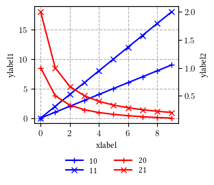
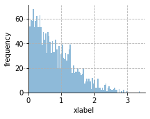

# My pyplot-gallery

This is a small gallery of pyplot examples. Hopefully I can retrieve the sample codes and save some time in the future. 
Take a quick look at the following illustrations to see available samples. 

In addition, the file [style.py](submodules/style.py) contains useful functions to (globally) change the style for scientific publication LaTeX templates.

# Illustrations

#### Figure 1 [[SRC]](submodules/fig1/fig1.py)

#### Figure 2 [[SRC]](submodules/fig2/fig2.py)
