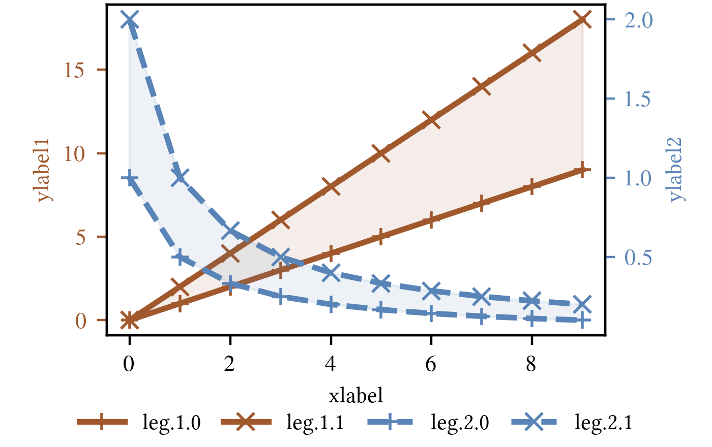
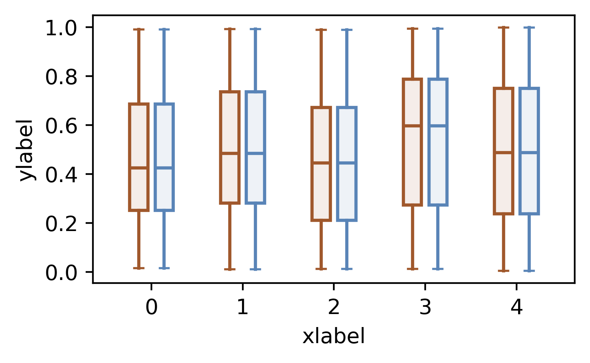
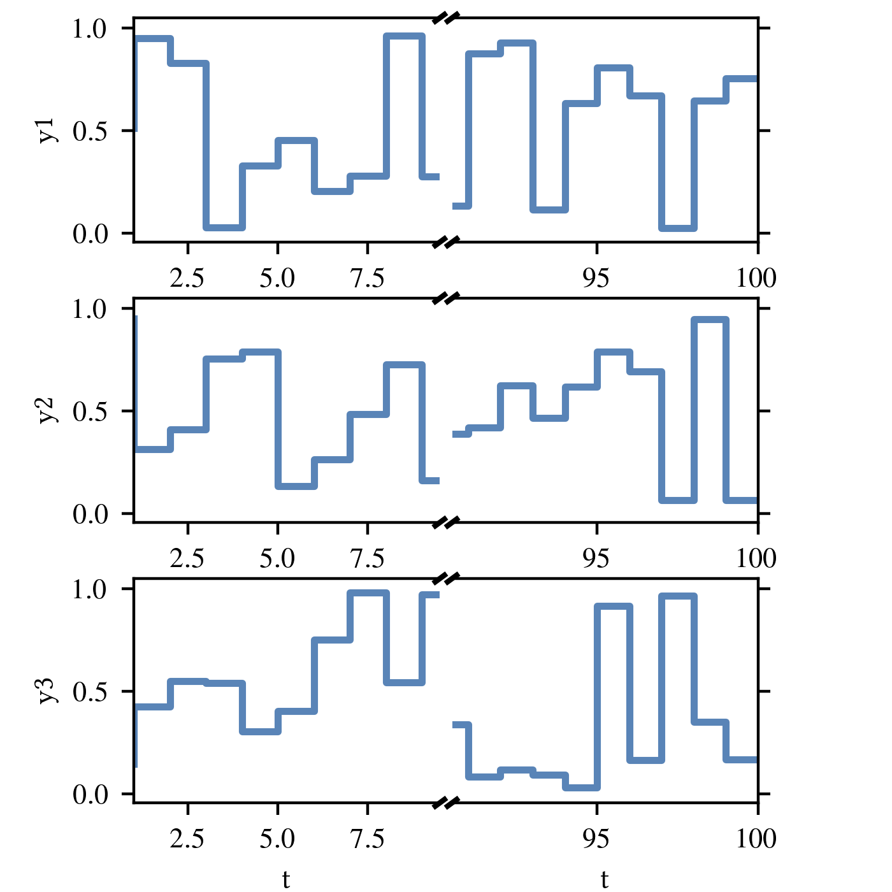

# My pyplot-gallery

This is a small gallery of pyplot examples. Hopefully I can retrieve the sample codes and save some time in the future. 
Take a quick look at the following illustrations to see available samples. 

In addition, the file [style.py](./style.py) contains useful functions to (globally) change the style for scientific publication LaTeX templates.

# General Tips


The text styles (font size, font family, etc.) of IEEE templates are [here](https://www.ieee.org/content/dam/ieee-org/ieee/web/org/pubs/format-definition-table-and-glossary.pdf) and of ACM templates are [here](https://www.acm.org/binaries/content/assets/publications/article-templates/sig-alternate-guide.pdf).

## Font size
The font size of figure caption in ACM template is 9pt and the font size caption in IEEE template is 8pt. We can use the command 

```
matplotlib.rc("font", size=9)
```
to globally change the font size of all figures.

## Figure size
- For IEEE templates, the single column width is 7.25 inches. For double column width, each column's width is 3.5 inches. 
- For ACM two-comlumn templates, each column's width is 3.33 inches.

We can use the command
```
fig.set_size_inches(3.5, 2)
```
to change the figure size. Note that the hight of the figure might need to be adjusted case by case.


## Others
- We can use the command `matplotlib.rc("text", usetex=true)` to use TeX engine to render the figure. But we need to have LaTeX engine installed in the computer.
- I also define some colors in the file [style.py](./style.py).


# Illustrations

#### Figure 1 [[SRC]](fig1.py)

[](figs/fig1.png)

#### Figure 2 [[SRC]](fig2.py)

[](figs/fig2.png)

#### Figure 3 [[SRC]](fig3.py)

[](figs/fig3.png)

#### Figure 4 [[SRC]](fig4.py)

[](figs/fig4.png)

#### Figure 5 [[SRC]](fig5.py)

[](figs/fig5.png)